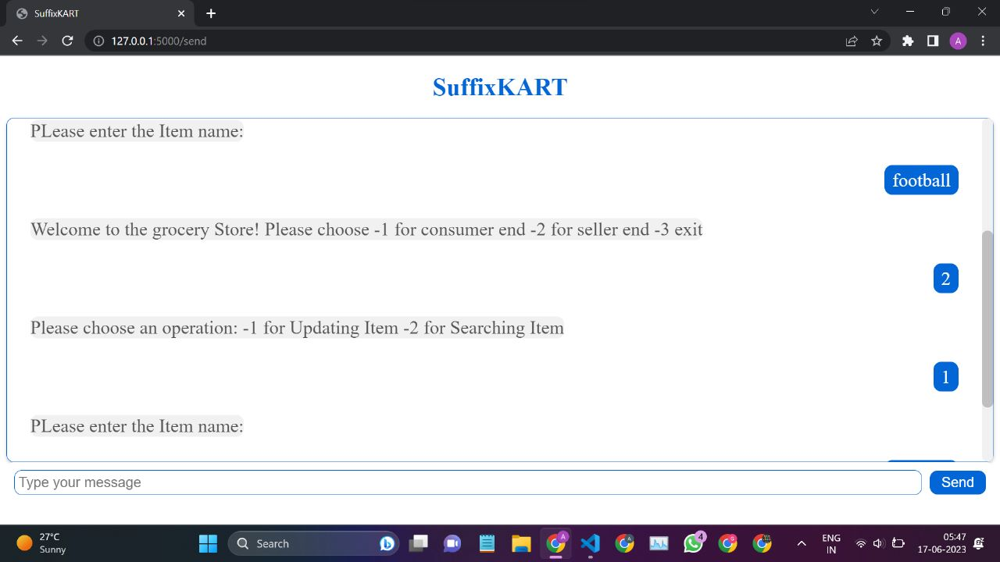

# Grocery Management System

Welcome to the Grocery Management System! This system allows buyers and sellers to interact with each other. Instead of running the application through a terminal, you can now access it through a chat website and receive responses from the bot.

## Running Instructions

1. Run `app.py` to start the application.
2. Run `listen.py` to enable the chat functionality.
3. Start the localhost to access the chat website.

**Note:** Make sure not to enter wrong inputs as it may cause unexpected behavior.

## Compilation Instructions

To compile the code, follow these steps:

```bash
g++ Suffix_tree.c PatternSearch.c main.cpp bloom.cpp BK_Tree.cpp
```

## Buyer End

At the buyer end, you can enter your name and the items you need. The system provides the following features:

- Auto Correct (using BK-Tree): Helps with suggesting corrections for inputted item names.

## Seller End

At the seller end, you can add items and search the order list, as well as generate a full receipt. The system offers the following features:

- Unique Item List (using Bloom Filter): Ensures that the item list contains only unique items.
- Fast Search (using Suffix Tree): Enables quick searching within the order list.

## DEMO



## Warnings

Please take note of the following warnings while using the system:

- After entering each item name as a buyer, press Enter.
- Avoid using items that are subsets of one another.
- Do not use names longer than 99 characters or less than 1.

Enjoy using the Grocery Management System!
