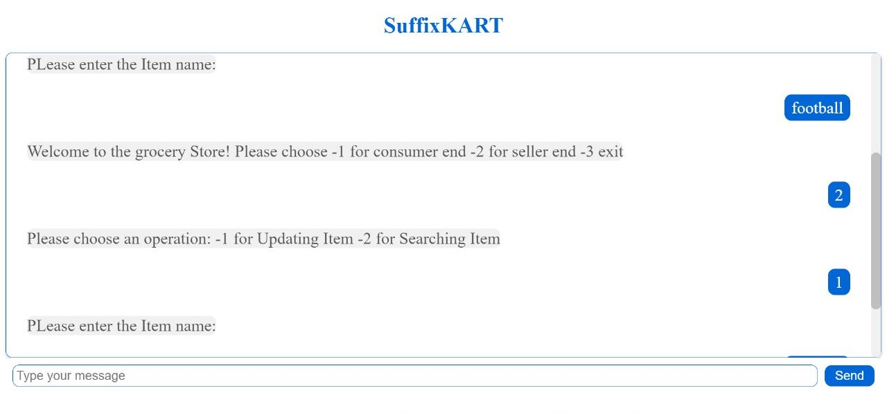

# Grocery Management System

Welcome to the Grocery Management System! This system allows buyers and sellers to interact with each other through a chat website. You can now access the system conveniently without the need for a terminal. The bot will provide responses to your queries and requests.

## Running Instructions

To run the Grocery Management System, follow these steps:

1. Start the application by running `app.py`.
2. Enable the chat functionality by running `listen.py`.
3. Access the chat website through the localhost.

**Note:** It is important to provide correct inputs to ensure the system functions properly.

## Compilation Instructions

To compile the code, follow these steps:

```bash
g++ Suffix_tree.c PatternSearch.c main.cpp bloom.cpp BK_Tree.cpp
```

## Buyer End

At the buyer end, you can enter your name and specify the items you need. The system provides the following quality features:

- **Auto Correct** (using BK-Tree): The system suggests corrections for inputted item names, ensuring accuracy and convenience.

## Seller End

At the seller end, you can add items, search the order list, and generate a full receipt. The system offers the following quality features:

- **Unique Item List** (using Bloom Filter): The system ensures that the item list contains only unique items, avoiding duplicates and maintaining data integrity.
- **Fast Search** (using Suffix Tree): The system enables quick and efficient searching within the order list, saving time and improving productivity.

## DEMO



## Warnings

Please take note of the following warnings while using the system:

- After entering each item name as a buyer, press Enter.
- Avoid using items that are subsets of one another.
- Do not use names longer than 99 characters or less than 1.

Enjoy using the Grocery Management System!
